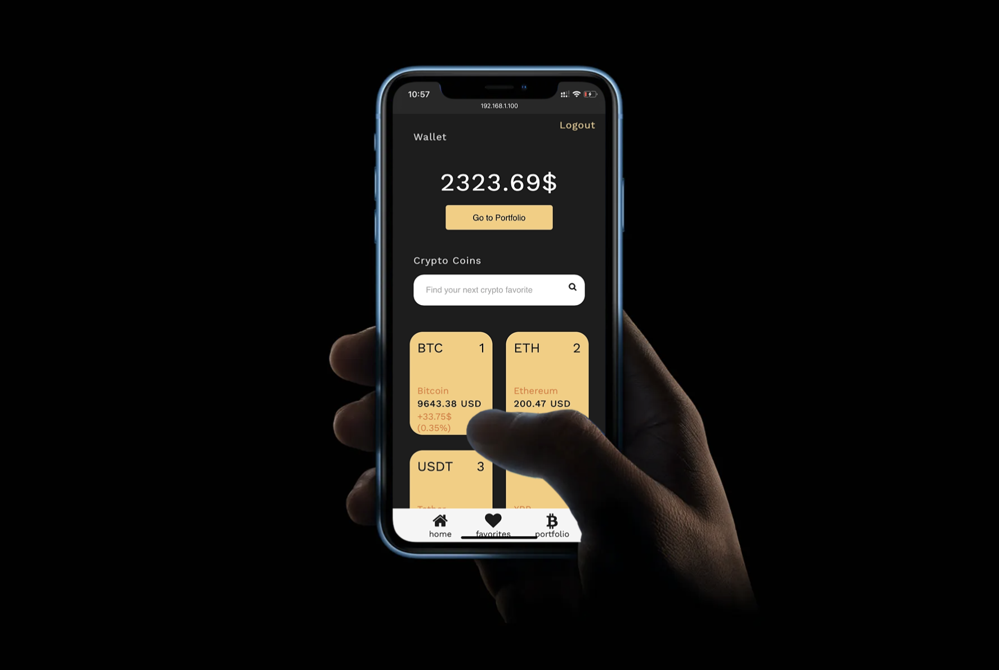
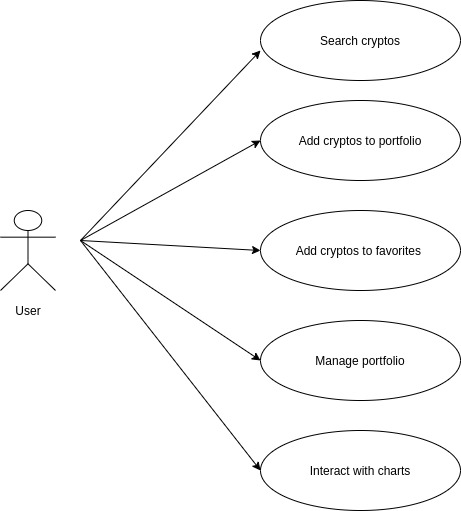
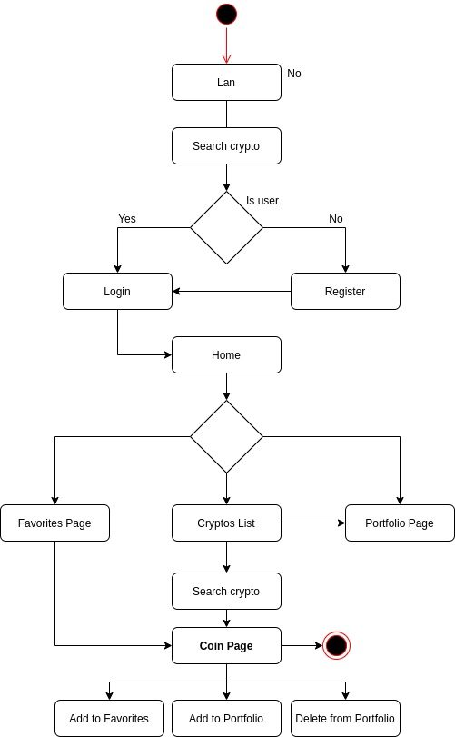
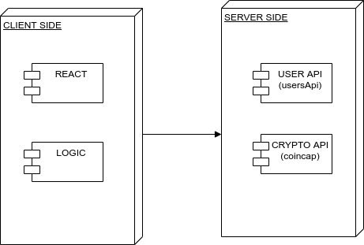
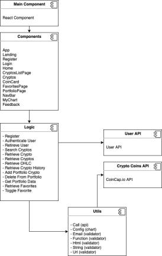
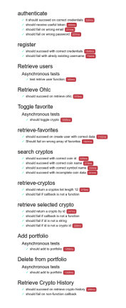

# Cryptonite the best way to keep accurate track of your cryptocurrency portfolio.
## Introduction
This app is a crypto tracker, generates useful information in real time, such as the value of your favourite coins, balances and  updated graphics.

## Functional Description

- Login
- Register
- Search cryptos
- Real time data of chosen crypto
- Follow cryptos
- Manage portfolio cryptos
- Overview of portfolio gains/loses
- Chart historical data up to 200 days

### Use Cases

### Activities (flows)

## Technical Description

### Blocks

### Components

### Testing

# Thank you

- to Manu, Alex Park, Alex Martínez, Jose Rodríguez for their support.
- to Lisandro for his support and also his generous contribution to our charts.
